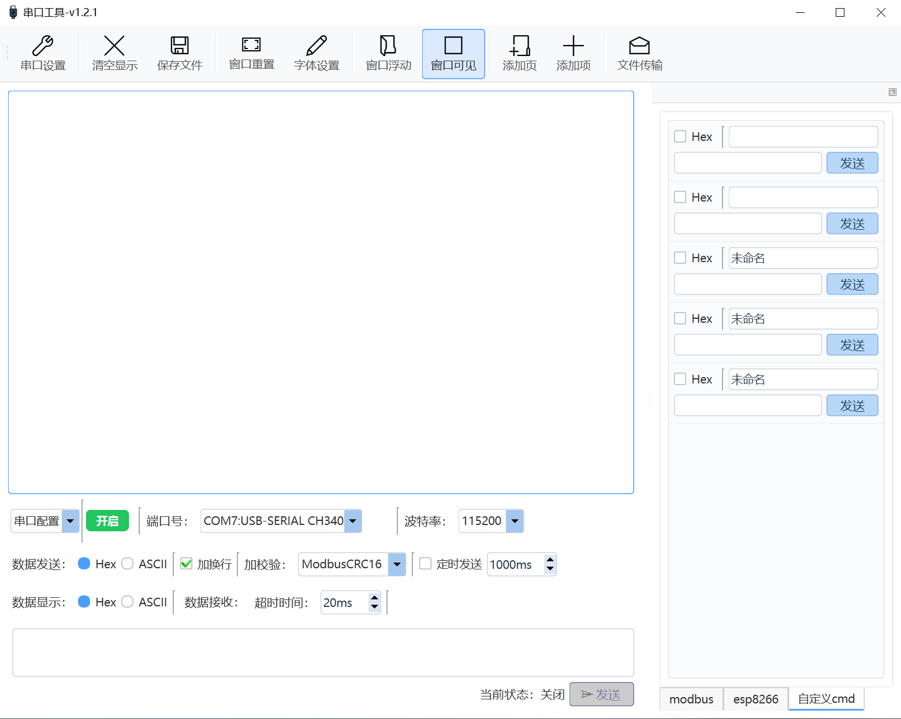

# Qt串口工具



## 功能介绍
一个基于 Qt6 开发的通用串口、网络调试工具，支持自定义数据发送、IAP升级。

## 版本更新记录
### v1.0.0(2026-04-18)
- 初始版本发布

### v1.0.1(2026-04-22)
- 新增：显示接收到的字节数
- 新增：自定义发送项插入功能

### v1.0.2(2026-05-01)

- 新增：选中计算数据量
- 优化：收到数据自动移动最下

### v1.1.0(2026-05-09)

- 新增：bin文件传输实现IAP
- 优化：重构代码。分tab自定义

### v1.2.0(2026-05-14)
- 新增：网络调试

### v1.2.1(2026-05-16)

- 优化：qss

### v1.2.2(2026-07-07)

- 新增w25qxx指令

## 源码编译

```bash
# 配置 CMakePresets.json 中 qt6 安装路径后
cmake --preset release					# 创建build目录并配置项目
cmake --build build/release -j 16		# 并行构建项目
cd build/release && ./SerialTool.exe	# 执行exe文件
```

### 待更新
- 蓝牙模式
- 服务端模式支持多客户端连接
- 文件传输加结束帧